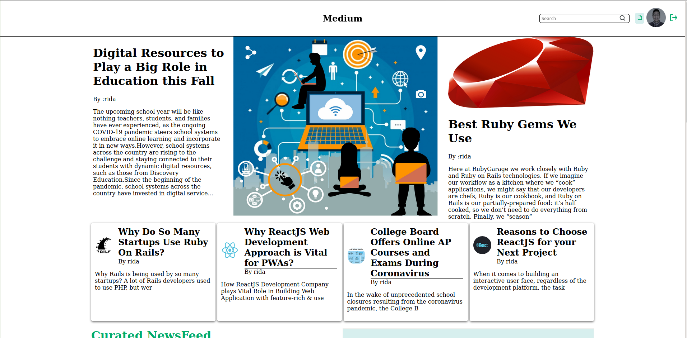
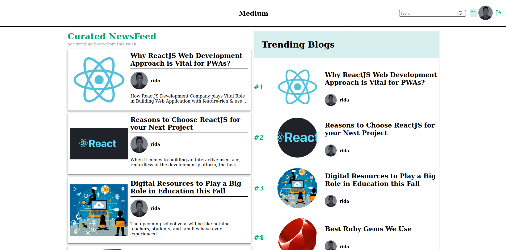

# BlogWithNode

This project is a React web app that is connected to my NodeJs backend app.
it a blog where users can sign up / in, create and edit their blogs, read other's blogs, comment their opinion, and more.

### Live Link

[click here](https://blogwithnode.vercel.app/)


### ScreenShot




## Built With

- React
- Redux
- JSX
- Sass
- JavaScript
- VS Code
- NPM
- Axios

## Prerequisites

You must have a browser on your PC in order to use the application. [Click here](https://www.mozilla.org/en-US/firefox/new/) to download one.

you must have [NodeJS](https://nodejs.org/en/)

## Getting Started

1. clone the project

```bash
# Clone this repository
$ git clone https://github.com/rida-elbahtouri/ReadThm.git

# Go into the repository
$ cd Medium_Redesign


```

**You can Install the dependencies with this commands**

```bash
$ npm install

```

### start the app

```bash
$ npm  start
 # and open the link provided
```


## Authors

👤 **Rida Elbahtouri**

- [Github](https://github.com/rida-elbahtouri)
- [Twitter](https://twitter.com/RElbahtouri)
- [Linkedin](https://www.linkedin.com/in/rida-elbahtouri/)

## 🤝 Contributing

Contributions, issues and feature requests are welcome!

Feel free to check the <a href="https://github.com/rida-elbahtouri/ReadThm/issues" target="_blank">issues page</a>.

## Show your support

Give a ⭐️ if you like this project!

## Acknowledgments

- <a href="https://reactjs.org/" target="_blank">React js</a>
- <a href="https://redux.js.org" target="_blank">Redux JS</a>
- <a href="https://vercel.com" target="_blanck">Vercel </a> (The WebSite Used To Deploy The App)
- <a href="https://www.behance.net/gallery/65519803/Medium-A-Comprehensive-Redesign" target="_blank">The Design</a>
